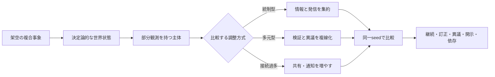

# Ghost in the Sim

> **異議を消さずに、複合危機の「もしも」を比べる。**
>
> 日本型の架空社会で、部分観測を持つ複数主体が、何を確かめ、誰に説明し、どの可逆的な行動を選ぶかを比較するメタ安全保障シミュレーションです。

| これは | これはしない |
|---|---|
| 同じ初期条件で、統制・多元・接続過多を比べる実験台 | 現実の危機・組織・個人を予測、評価、指示する道具 |
| 根拠、留保、異議、訂正、依存をログとして残す | 単一の正解や「最強の統治」を決める装置 |

> 現在地: **設計レビュー中・実装前**。未解決事項は [設計上の未解決事項](docs/knowledge/open-questions.md) に記録しています。実在組織、現実の危機、政策・安全保障上の行為を指示・予測するものではありません。

## 実験の見取り図



## 30秒でわかるMVP

| 固定するもの | 変えるもの | 観測するもの |
|---|---|---|
| 事象、主体、資源、seed | 調整方式と接続の設計 | 生活継続、証拠校正、訂正時間、異議、開示、依存 |

最初の舞台は、港湾・物流・医療・地域メディアがつながる**架空都市圏「ポセイドン」**です。公共データ連携の障害、物流の遅れ、不確かな情報の拡散が重なったとき、6〜8のオリジナル主体が12ターン行動します。

固有の作品、人物、地名、組織、画像、台詞、技術設定は使いません。創作から得た問いは、比較可能なオリジナルの状態・制約・指標に翻訳します。

## 最初に読むもの

1. [一枚設計](docs/architecture/overview.md) — 問い、MVP、比較実験、反証条件
2. [シミュレーション契約](docs/architecture/simulation-contract.md) — 再現性、ターン、入力・出力、禁止事項
3. [エージェント契約](docs/architecture/agent-contract.md) — 単純な役職ではない主体モデル
4. [画面・可視化仕様](docs/design/ui-contract.md) — 将来のWebアプリで何を見せ、何を操作するか
5. [意思決定記録（最初の設計判断）](docs/adr/ADR-001-original-agent-model.md) — 設計上の選択と却下した代案
6. [PRセルフレビュー](docs/pr-self-review.md) — 横断的な再発防止ルールに沿った変更前確認

## 中心の問い

架空の日本型社会で、公共デジタル基盤の障害が生活継続と情報信頼へ連鎖するとき、**権限を一箇所へ集中する対応**と、**検証・異議・説明を複数主体へ分散する対応**は、どの条件で回復力を高め、どの条件で遅延や依存を生むか。

この問いを「勝者を決める」ためではなく、次のトレードオフを観測するために使います。

- 初動速度と証拠の確かさ
- 一貫した発信と異議・訂正可能性
- 連携の便益と特定ノードへの依存
- 生活継続と情報開示の範囲

詳しくは [MVP仕様](docs/architecture/overview.md#mvp) と [評価設計](docs/architecture/evaluation.md) を参照してください。

## 目指す画面

将来のWebアプリは、物語を眺めるだけの画面ではなく、同じ世界を条件だけ変えて比較する実験台です。

- 世界状態と三相（モノ／組織／意味）の連鎖
- 各主体の観測・確信度・留保・提案の台帳
- 行動の可逆性と影響範囲
- 同一seedでの比較結果と反証条件

UI仕様は [画面・可視化仕様](docs/design/ui-contract.md)、実装順序は [ロードマップ](docs/roadmap.md) にあります。

## 情報源と権利境界

- メタ安全保障の概念原典は、[ハッカソン公式](https://hackathon.automata-lab.jp/) とそこから参照される片山俊大氏の構想ペーパー Version 1.0 です。本文は転載しません。
- 本プロジェクト名と着想は、ネットワーク化・複数性を扱う創作作品から影響を受けています。ただし、特定の作品、キャラクター、台詞、画像、ロゴ、組織を再現・利用しません。
- 詳細な出典の優先順位と未確認事項は [知識索引](docs/knowledge/README.md) を参照してください。

## 研究・実装の道筋

```text
問いを固定する → 状態・主体・制約を記述する → 同一seedで比較する
      ↑                                              ↓
  反証条件を置く ← 失敗runと限界を記録する ← 指標とログを読む
```

ローカル知識と外部先行事例をどう採用・保留したかは、[統合メモ](docs/research/local-and-external-synthesis.md) を参照してください。

## 開発

実装前の設計レビューは、次の順で行います。

1. [設計上の未解決事項](docs/knowledge/open-questions.md) を確認する。
2. [シミュレーション契約](docs/architecture/simulation-contract.md) に沿って、シナリオと比較条件を小さく固定する。
3. seed固定・実行ログ・結果比較が揃う最小実装を作る。
4. [RESULTS.md](RESULTS.md) に実験の前提、結果、反証、限界を記録する。

- 貢献方法: [CONTRIBUTING.md](CONTRIBUTING.md)
- PR前の再発防止確認: [PRセルフレビュー](docs/pr-self-review.md)（生成物。手編集しない）
- セキュリティ連絡: [SECURITY.md](SECURITY.md)
- 公開準備: [PREFLIGHT.md](PREFLIGHT.md) / [PUBLIC_READY.md](PUBLIC_READY.md)
- リポジトリ運用: [運用ゲート](docs/operations/repository-gates.md)

## ライセンス

リポジトリ内のNexus作成物は [MIT License](LICENSE) です。第三者資料には適用されません。
