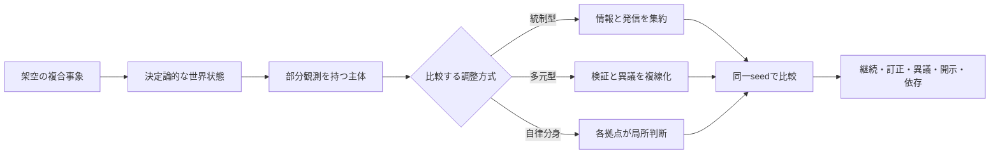

# Ghost in the Sim

> **異議を消さずに、複合危機の「もしも」を比べる。**
>
> 日本型の架空社会で、部分観測を持つ複数主体が、何を確かめ、誰に説明し、どの可逆的な行動を選ぶかを比較するメタ安全保障シミュレーションです。

## 目的

複合危機への対応を「最強の統治を選ぶ問題」にせず、同じ初期条件のもとで調整方式を変えたときの便益・副作用・反証条件を比較可能にします。

| これは | これはしない |
|---|---|
| 同じ初期条件で、中央正本・複数承認・自律分身を比べる実験台 | 現実の危機・組織・個人を予測、評価、指示する道具 |
| 根拠、留保、異議、訂正、依存をログとして残す | 単一の正解や「最強の統治」を決める装置 |

> 現在地: **ポセイドン世界と10事件を正本化し、鏡潮事案では御影・真壁を含む検証済みtrajectoryを操作・replayできます。** 残り9事件やlive providerは未実装です。実測済みの結果だけを [RESULTS.md](RESULTS.md) に記録します。

### いま動くもの

AI判断は監査traceとして再生し、許可済みactionだけが有界deltaとして状態へ反映されます。live モデルAPIは呼びません。

| 層 | 中身 | 状態 |
|---|---|---|
| 設定 | 2036年、ポセイドン、御影冴、接界機動班、命名、10事件 | 正本化。御影・真壁・鏡潮はrun bundleへ接続 |
| 実行 | 12ターン決定論コア、正本集中／複数承認／自律分身、seed `{17, 42, 99}`、rule と actual-AI replay | 実装し、9 run を実測 |
| 観察 | 鏡潮作戦端末、比較Web UI、機械可読 result card、失敗run・符号反転 | 実装し、[RESULTS.md](RESULTS.md) と同期 |
| 引継ぎ | `meta-security-run-bundle/v1`（同一 `run_id` で request / event / replay / evidence） | 実装。renderer は読むだけで runtime を再計算しない |

コードの入口は `src/ghost_in_the_sim/engine.py`、`replica.py`、`run_bundle.py`、`web/index.html` です。

### まだ動かないもの

- 注意配分を画面から変更して新trajectoryを生成する対話runner
- 御影の身体切替を含む完全なプレイヤー操作
- 鏡潮以外の9事件を、型付きscenarioとして最後までプレイする体験
- live モデル接続、Three.js / GSAP / Godot

これらは [ロードマップ](docs/roadmap.md) の未チェック項目です。設定があることを実装完了としません。

## 実験の見取り図



## できること — 30秒でわかるMVP

| 固定するもの | 変えるもの | 観測するもの |
|---|---|---|
| 事象、主体、資源、seed | 調整方式と接続の設計 | 生活継続、証拠校正、訂正時間、異議、開示、依存 |

最初の舞台は、港湾・物流・医療・地域メディアがつながる**海洋複合都市圏「ポセイドン」**です。危機対応AIの複製が各拠点へ配備された後に通信が分断され、記憶・方針・権限世代が分岐します。再接続までの12ターンで、正本集中・複数承認・自律分身の3方式を同じ外生事象列で比較します。

本作は名称オマージュを明示する非公式の二次創作的プロジェクトです。公式・続編・同一世界とは主張せず、第三者作品の本文、台詞、人物、部隊、事件、外見、ロゴ、画像、音声、画面は複製しません。創作から得た問いは、比較可能な独自の状態・制約・指標に翻訳します。

結果は合成データと仮定に基づく観測であり、現実予測、因果証明、政策の正しさ、実在する人物・組織の評価を示しません。

## 最初に読むもの

1. [一枚設計](docs/architecture/overview.md) — 問い、MVP、比較実験、反証条件
2. [シミュレーション契約](docs/architecture/simulation-contract.md) — 再現性、ターン、入力・出力、禁止事項
3. [エージェント契約](docs/architecture/agent-contract.md) — 単純な役職ではない主体モデル
4. [AI複製主体MVP](docs/architecture/ai-replica-mvp.md) — 分岐、権限失効、3方式、AI安全境界
5. [世界設定正本](docs/world/setting-bible.md) — 2036年、ポセイドン、境界局、卓越性
6. [実働者契約](docs/architecture/operative-contract.md) — 設定を状態・行動・評価へ写像する契約
7. [画面・可視化仕様](docs/design/ui-contract.md) — Web実験画面で何を見せ、何を操作するか
8. [意思決定台帳](docs/knowledge/decisions.md)／[最初の設計判断](docs/adr/ADR-001-original-agent-model.md) — 採用状態、置換関係、却下した代案
9. [PRセルフレビュー](docs/pr-self-review.md) — 横断的な再発防止ルールに沿った変更前確認
10. [ODD形式のモデル記述](docs/architecture/model.odd.md) — 目的、主体、ターン順序、入出力
11. [登場人物正本](docs/world/characters.md)／[事件カタログ](docs/world/cases.md) — 御影冴、真壁迅、10事件
12. [リポジトリゴール](docs/product/repository-goal.md)／[ロードマップ](docs/roadmap.md) — 完了条件と発展余白
13. [用語と先行手法](docs/research/simulation-terms.md) — ABM、ODD、CRN、監査ログの採用範囲

## 中心の問い

架空の日本型社会で、公共デジタル基盤の障害が生活継続と情報信頼へ連鎖するとき、**権限を一箇所へ集中する対応**と、**検証・異議・説明を複数主体へ分散する対応**は、どの条件で回復力を高め、どの条件で遅延や依存を生むか。

この問いを「勝者を決める」ためではなく、次のトレードオフを観測するために使います。

- 初動速度と証拠の確かさ
- 一貫した発信と異議・訂正可能性
- 連携の便益と特定ノードへの依存
- 生活継続と情報開示の範囲

詳しくは [MVP仕様](docs/architecture/overview.md#mvp) と [評価設計](docs/architecture/evaluation.md) を参照してください。

## プレイヤー体験

狙う体験では、プレイヤーは架空組織「境界局・接界機動班」の最高水準の実働調整官・御影冴です。複数の遠隔身体、AI、センサー、分岐主体を横断し、事件へ介入します。通常の技術課題は高い確率で処理できますが、すべての現場へ最高精度で同時介入することはできません。

難しさは主人公の能力不足ではなく、相反する正規命令、生活と法の衝突、不可逆な介入、分岐した自己の権利にあります。

> ほぼ何でもできる。それでも、何をするべきかは決まらない。

既存比較主体は次の6つで、`src/ghost_in_the_sim/engine.py` の `ACTOR_PROFILES` を正本とします。これに加え、鏡潮の操作trajectoryでは御影の有限注意・8状態と真壁の独立停止要求を別contractとして記録します。

| actor_id | runtime上のmission |
|---|---|
| `service_steward` | 生活サービスを止めない |
| `evidence_verifier` | 主張の来歴と反証を残す |
| `community_liaison` | 地域の理解と訂正可能性を守る |
| `continuity_coordinator` | 分断された支援を接続する |
| `independent_observer` | 決定前の異議を可視化する |
| `privacy_steward` | 必要最小限の開示を守る |

御影／真壁は `operative.py` と検証済みrun bundleへ接続済みです。ブラウザは状態を再計算せず、runtimeが生成した成功確度・代償・状態前後を表示します。事件カタログで実装済みなのは鏡潮だけです。

## 実験画面

Web画面は物語を眺めるだけでなく、同じ世界を条件だけ変えて比較する実験台です。いまの viewer が見せるのは次です。

- 3方式の指標（生活継続、証拠校正、訂正時間、異議、開示、依存）
- seed 17 / 42 / 99 の切り替え
- ターンごとの主体・主張・留保・可逆性
- 失敗run、反証、限界を同じ result card で表示

UI仕様は [画面・可視化仕様](docs/design/ui-contract.md)、実装順序は [ロードマップ](docs/roadmap.md) にあります。

## 安全境界と限界

- 結果は明示した仮定とseedのもとでの比較であり、現実予測や政策推奨ではありません。
- 実在する個人・組織・危機を評価、指示、再現する用途には使いません。
- 実験結果だけでなく、失敗run、感度、反証条件、再現不能な点も同じ台帳へ残します。

## 情報源と権利境界

- メタ安全保障の概念原典は、[ハッカソン公式](https://hackathon.automata-lab.jp/) とそこから参照される片山俊大氏の構想ペーパーです。公開版の版番号は資料間で一致を確認できていないため断定せず、本文も転載しません。
- 本プロジェクト名と着想は、ネットワーク化・複数性を扱う創作作品から影響を受けています。ただし、特定の作品、キャラクター、台詞、画像、ロゴ、組織を再現・利用しません。
- 詳細な出典の優先順位と未確認事項は [知識索引](docs/knowledge/README.md) を参照してください。

## 研究・実装の道筋

```text
問いを固定する → 状態・主体・制約を記述する → 同一seedで比較する
      ↑                                              ↓
  反証条件を置く ← 失敗runと限界を記録する ← 指標とログを読む
```

ローカル知識と外部先行事例をどう採用・保留したかは、[統合メモ](docs/research/local-and-external-synthesis.md) を参照してください。

## クイックスタート

最小実験は、次の順で実行します。

1. [設計上の未解決事項](docs/knowledge/open-questions.md) を確認する。
2. [シミュレーション契約](docs/architecture/simulation-contract.md) に沿って、シナリオと比較条件を小さく固定する。
3. 同じseedで条件だけを変え、差分とイベントログを比較する。
4. [RESULTS.md](RESULTS.md) に実験の前提、結果、反証、限界を記録する。

```powershell
$env:PYTHONPATH = "src"
py -3.13 -m ghost_in_the_sim.batch_cli --output web/data/comparison.json --actual-ai-evidence-trace fixtures/actual-ai-trace-seed42.json
py -3.13 scripts/serve_demo.py
```

このコマンドは正本 `web/data/comparison.json` を再現するもので、[RESULTS.md](RESULTS.md) の「再現」節と同一です（テストが一致を検査します）。比較本体は3seedともrule providerで条件を揃え、fixtureに保存した「この開発セッションでAIが生成した9判断と来歴」は独立replay証拠として同じartifactへ記録します。ブラウザで `http://127.0.0.1:8045/` を開くと、3方式の指標と12ターンのイベントを比較できます。

`--actual-ai-trace` はAI判断を比較条件そのものへ混ぜる実験用オプションで、正本comparison.jsonの生成には使いません。traceが覆わないseedを要求するとCLIはfallbackへ黙って落とさずエラーで停止します。いずれの経路も外部モデルAPIをライブ呼び出す機能ではありません。actionの影響は固定・有界で、自由文をコードや命令として実行しません。

外部runnerや別rendererへ1回の実行を渡す場合は、同じruntimeからportable bundleを生成します。

```powershell
$env:PYTHONPATH = "src"
py -3.13 -m ghost_in_the_sim.run_bundle_cli --mode plural --seed 42 --turn-limit 12 --output artifacts/run-bundle-seed42.json
```

出力schemaは `meta-security-run-bundle/v1` です。`run_request`、`event_stream`、`replay`、`evidence`を同一`run_id`で結び、event順序、区画digest、既存runtimeでのreplay一致を検証します。体験技術の採否と撤退境界は [ADR-013](docs/adr/ADR-013-run-bundle-and-experience-technology.md) を参照してください。

外部AIへ12ターンを逐次依頼する場合は、未来のrequestを先に作らず、確定状態を一手ずつ取り込むsession runnerを使います。

```powershell
$env:PYTHONPATH = "src"
py -3.13 -m ghost_in_the_sim.agent_turn_cli session-init --seed 42 --mode plural --turn-limit 12 --output artifacts/cloud-handoff/session.json
py -3.13 -m ghost_in_the_sim.agent_turn_cli session-advance --session artifacts/cloud-handoff/session.json --proposals artifacts/cloud-handoff/proposals.json --output artifacts/cloud-handoff/session.json
```

各turnでは`session.json`の`current_request_bundle`だけを外部runnerへ渡し、返却された4主体のproposal束を`session-advance`へ入力します。最終turnで同じsession内に検証済み`meta-security-run-bundle/v1`が生成されます。session更新はatomicで、中断時に直前の確定履歴を残します。schema、digest、欠落・重複・古い応答、外部runnerとの責務境界は[agent turnプロトコル](docs/architecture/agent-turn-protocol.md)を正本とします。このCLI自身はnetwork、provider SDK、credentialを所有しません。

GitHub Actionsでも、同一入力の再現性・条件差・イベント契約・公開境界を回帰検査する。CI成功は、現実予測の妥当性や公開承認を意味しない。

- 貢献方法: [CONTRIBUTING.md](CONTRIBUTING.md)
- PR前の再発防止確認: [PRセルフレビュー](docs/pr-self-review.md)（生成物。手編集しない）
- セキュリティ連絡: [SECURITY.md](SECURITY.md)
- 公開準備: [PREFLIGHT.md](PREFLIGHT.md) / [PUBLIC_READY.md](PUBLIC_READY.md)
- リポジトリ運用: [運用ゲート](docs/operations/repository-gates.md)

## ライセンス

リポジトリ内のNexus作成物は [MIT License](LICENSE) です。第三者資料には適用されません。
