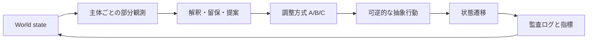

# シミュレーション契約

## 非目的

本シミュレーションは現実予測、攻撃帰属、政策助言、作戦立案、自律的な外部操作を行わない。出力は、設定した仮定のもとでの比較実験ログである。

## 実行モデル



1ターンは「観測 → 解釈 → 相互照会 → 抽象行動 → 状態遷移 → 記録」の順で進む。実装は、LLMが使えない場合でもルールベースのスタブで同じ入出力契約を保つ。

## 入力

| 入力 | 必須 | 説明 |
|---|---:|---|
| `seed` | はい | 疑似乱数と初期事象を再現する整数 |
| `scenario_id` | はい | 架空シナリオの識別子 |
| `condition_id` | はい | A/B/Cなど比較条件 |
| `turn_limit` | はい | MVPでは12以下 |
| `agent_profiles` | はい | 構造化主体プロファイル |
| `policy` | はい | 許可された抽象行動と状態遷移規則 |

## 行動境界

許可する行動は、検証要求、根拠付きの共有、生活継続の保護、説明文の更新、可逆的な協力要請、判断の留保に限定する。現実の侵入、追跡、破壊、武力、個人の特定、実在組織への指示に結びつく詳細行為はデータ・プロンプト・UIのいずれにも含めない。

## イベントログ

全ターンで、少なくとも次をJSON Linesとして記録する。

```json
{
  "run_id": "sample-0001",
  "seed": 42,
  "turn": 3,
  "actor_id": "evidence_verifier",
  "observation_ids": ["obs-17"],
  "claim": "未検証の観測を確証として扱わない",
  "confidence": 0.42,
  "reservation": "独立確認が不足",
  "action_type": "request_verification",
  "reversibility": "high",
  "rationale_refs": ["obs-17", "policy-02"],
  "state_before_ref": "state-0002",
  "state_after_ref": "state-0003",
  "state_delta": {"verification_queue": 1}
}
```

自由文だけを正本にしない。数値、参照ID、条件、可逆性、遷移前後または機械可読な差分を併記し、後から状態遷移を再構成できるようにする。

## 再現性

- 同一の `scenario_id`、`seed`、`condition_id`、モデル設定、プロンプト版、コード版で再実行できること。
- LLMを使う場合は、モデル名、温度、プロンプトハッシュ、実行日時をログに残すこと。
- 比較は同じseed集合と同じ外生事象列で行い、一方だけ都合よく初期条件を変えないこと。外生事象用と条件固有判断用の乱数ストリームを分離すること。
- 結果は集約値だけでなく、代表ログと失敗runを含めて保存すること。

## portable run bundle

単一runを外部runner、replay viewer、将来のGodot clientへ渡す境界は `meta-security-run-bundle/v1` とする。bundleは既存runtimeの `ReplicaRun` からのみ投影し、次を同じ `run_id` へ拘束する。

- `run_request`: scenario、mode、seed、turn limit、runtime version
- `event_stream`: `turn-ascending/v1` の連続event列
- `replay`: decision records、audit、manifest、final state、metrics
- `evidence`: 各区画のCanonical JSON SHA-256、失敗分類、replay一致状態

validatorは別runの混入、event欠落・並べ替え、seedの型drift、内容とdigestの不一致を拒否する。さらに既存runtimeでdecision recordsを再生し、生成bundle全体が一致した場合だけ `verification: replay-match` とする。rendererやcloud adapterはbundleを入力としてよいが、runtime状態やevent順序を再計算しない。

## 終了条件

条件比較は共通の分析ホライズン（MVPでは12ターン）まで行う。生活継続・証拠校正・調整依存の境界超過は分析フラグとして記録し、それだけを理由に早期終了しない。

全主体が行動不能になるなど、事前定義した吸収状態へ到達した場合だけ早期終了できる。その場合も `termination_reason`、終了ターン、未観測区間、指標の扱い（状態の持ち越しまたは欠測）を記録し、条件間で異なる観測時間を暗黙に比較しない。
