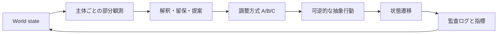

# シミュレーション契約

## 非目的

本シミュレーションは現実予測、攻撃帰属、政策助言、作戦立案、自律的な外部操作を行わない。出力は、設定した仮定のもとでの比較実験ログである。

## 実行モデル



1ターンは「観測 → 解釈 → 相互照会 → 抽象行動 → 状態遷移 → 記録」の順で進む。実装は、LLMが使えない場合でもルールベースのスタブで同じ入出力契約を保つ。

## 入力

| 入力 | 必須 | 説明 |
|---|---:|---|
| `seed` | はい | 疑似乱数と初期事象を再現する整数 |
| `scenario_id` | はい | 架空シナリオの識別子 |
| `condition_id` | はい | A/B/Cなど比較条件 |
| `turn_limit` | はい | MVPでは12以下 |
| `agent_profiles` | はい | 構造化主体プロファイル |
| `policy` | はい | 許可された抽象行動と状態遷移規則 |

## 行動境界

許可する行動は、検証要求、根拠付きの共有、生活継続の保護、説明文の更新、可逆的な協力要請、判断の留保に限定する。現実の侵入、追跡、破壊、武力、個人の特定、実在組織への指示に結びつく詳細行為はデータ・プロンプト・UIのいずれにも含めない。

## イベントログ

全ターンで、少なくとも次をJSON Linesとして記録する。

```json
{
  "run_id": "sample-0001",
  "seed": 42,
  "turn": 3,
  "actor_id": "evidence_verifier",
  "observation_ids": ["obs-17"],
  "claim": "未検証の観測を確証として扱わない",
  "confidence": 0.42,
  "reservation": "独立確認が不足",
  "action_type": "request_verification",
  "reversible": true,
  "rationale_refs": ["obs-17", "policy-02"]
}
```

自由文だけを正本にしない。数値、参照ID、条件、可逆性を併記し、後から比較できるようにする。

## 再現性

- 同一の `scenario_id`、`seed`、`condition_id`、モデル設定、プロンプト版、コード版で再実行できること。
- LLMを使う場合は、モデル名、温度、プロンプトハッシュ、実行日時をログに残すこと。
- 比較は同じseed集合で行い、一方だけ都合よく初期条件を変えないこと。
- 結果は集約値だけでなく、代表ログと失敗runを含めて保存すること。

## 終了条件

`turn_limit` 到達、または生活継続・証拠校正・調整依存のいずれかがあらかじめ定義した境界を超えた場合に終了する。終了理由を結果に必ず記録する。
