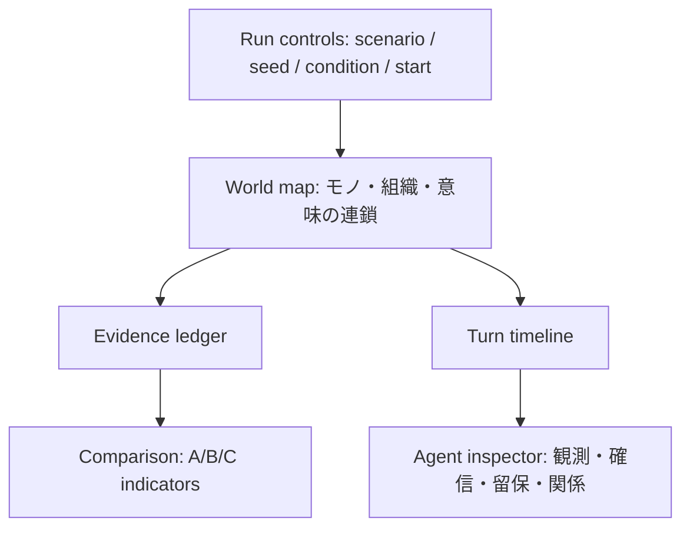

# 画面・可視化仕様

## 役割

このUIは、AIの会話を派手に見せるための画面ではない。比較条件、根拠、留保、可逆性、連鎖を、利用者が同じ画面で検証できる実験台である。

## 主画面

初期画面は研究用dashboardではなく、御影冴として鏡潮事案へ介入する作戦端末とする。日本語で事件状況と御影・真壁の役割を読み、最初に病院／港湾、病院を選んだ場合は共同確認／単一正本を順に選ぶ。共同確認の病院経路では第8ターンに真壁の停止要求へ保留／進行で応答し、検証済みtrajectoryを安全に切り替える。最終ターンでは「守った／失った／訂正可能／責任未確定」の4欄を示し、別の経路で再挑戦できる。seed、run_id、schema名、replay evidence、比較指標は折り畳んだ監査／反実仮想ビューへ置き、内部識別子をプレイヤーへ露出しない。

将来拡張は次の順序を候補とする。これは現行MVPの必須画面ではない。

| 領域 | 表示内容 | 主な操作 |
|---|---|---|
| 作戦端末 | 事件状況、御影・真壁の役割、病院／港湾、共同確認／単一正本、真壁の停止要求、成功見込み、代償、作戦完了要約 | 段階的な判断、作戦開始、前後ターン、最初から再開、別の経路で再挑戦 |
| 将来: 連鎖マップ | 三相をまたぐイベントと影響 | ターン選択、因果経路の絞り込み |
| 将来: 根拠台帳 | 事実、推論、未検証主張、留保 | 根拠の来歴を確認 |
| 将来: 主体インスペクタ | 目的、観測、確信、関係、提案 | 各主体の差を比較 |
| 監査／反実仮想ビュー | 3方式の指標・失敗run・反証条件・内部証拠 | 必要時だけ展開してA/B/Cを横並びで確認 |

## デザイン原則

- 背景は濃紺、情報は高コントラストの白、状態色はシアン・マゼンタ・ミント・オレンジに限定する。
- 色だけで意味を伝えず、常にラベル・形・説明を併記する。
- カードの羅列ではなく、左から右へ「条件 → 連鎖 → 根拠 → 比較」を読める情報面にする。
- 主張には必ず確信と留保を同居させる。断定だけを強調表示しない。
- モバイルでは連鎖マップ、根拠台帳、比較パネルを縦に分割し、重要情報を隠さない。

## 実装

初期Web版は依存を増やさないHTML/CSS/JavaScript viewerとして実装する。Pythonの`core`（決定論的）と`adapter`（判断replay）、`viewer`（ブラウザ）を分離し、生成した`web/data/comparison.json`だけを表示正本とする。

### 鏡潮オペレーションの表示境界

操作consoleは「ブラウザでsimulationを動かす画面」ではなく、Python runtimeが生成・検証した複数のtrajectoryから一つを選び、証拠を読むrendererである。

- 入力は `experience_capability` と `playable_trajectories` を持つ生成artifactに限定する。プレイヤー面では通常比較用の `trajectories` を正本にしない。
- 各trajectoryは `meta-security-run-bundle/v1` で、`run_request`、`event_stream`、`replay`、`evidence` が同じ `run_id` を持ち、`evidence.verification` が `replay-match` でなければならない。
- `experience_capability.renderer_mode` は `artifact-only` とする。JavaScriptはaction、`request_pause`、attention、成功見込み、代償、指標を生成・補完・再計算しない。
- `scenario_manifest`、`operative_plan`、イベントの `scenario_beat_id`、`operative_action`、`partner_action`、`success_confidence`、`cost_codes`、前後状態がすべて揃う場合だけconsoleを表示する。
- capability、検証、event順序、必須fieldのどれかを確認できなければfail closedとし、操作UIを隠して理由を示す。既存の比較viewerは維持する。
- trajectoryの選択は「別の検証済み経路を表示する」だけであり、プレイヤー入力をruntime actionとして実行したとは表現しない。
- プレイ用IDは `hospital-joint-hold`、`port-joint-hold`、`hospital-joint-proceed`、`hospital-single-proceed` のexact 4件だけを許可する。全runはseed 42、固有`run_id`とし、病院共同確認の保留／進行は第1〜7ターンが一致する場合だけ第8ターンで切り替える。存在しない選択肢の直積をUIで補完しない。

## アクセシビリティ

- キーボードでターン、主体、条件を操作できる。
- 色覚差に依存しない凡例とテキスト状態を持つ。
- 動きは `prefers-reduced-motion` で抑制する。
- ログは画面上の図だけでなく、機械可読なJSON Linesとして取得できる。
