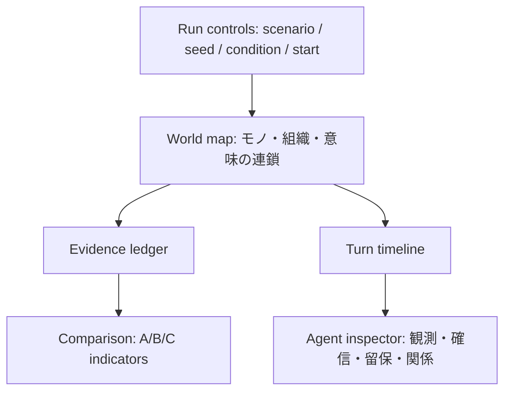

# 画面・可視化仕様

## 役割

このUIは、AIの会話を派手に見せるための画面ではない。比較条件、根拠、留保、可逆性、連鎖を、利用者が同じ画面で検証できる実験台である。

## 主画面

| 領域 | 表示内容 | 主な操作 |
|---|---|---|
| 実験バー | シナリオ、seed、条件、実行状態 | 条件選択、run開始、比較へ追加 |
| 連鎖マップ | 三相をまたぐイベントと影響 | ターン選択、因果経路の絞り込み |
| 根拠台帳 | 事実、推論、未検証主張、留保 | 根拠の来歴を確認 |
| 主体インスペクタ | 目的、観測、確信、関係、提案 | 各主体の差を比較 |
| 比較パネル | 指標・失敗run・反証条件 | A/B/Cを横並びで確認 |

## デザイン原則

- 背景は濃紺、情報は高コントラストの白、状態色はシアン・マゼンタ・ミント・オレンジに限定する。
- 色だけで意味を伝えず、常にラベル・形・説明を併記する。
- カードの羅列ではなく、左から右へ「条件 → 連鎖 → 根拠 → 比較」を読める情報面にする。
- 主張には必ず確信と留保を同居させる。断定だけを強調表示しない。
- モバイルでは連鎖マップ、根拠台帳、比較パネルを縦に分割し、重要情報を隠さない。

## 実装

初期Web版は依存を増やさないHTML/CSS/JavaScript viewerとして実装する。Pythonの`core`（決定論的）と`adapter`（判断replay）、`viewer`（ブラウザ）を分離し、生成した`web/data/comparison.json`だけを表示正本とする。

## アクセシビリティ

- キーボードでターン、主体、条件を操作できる。
- 色覚差に依存しない凡例とテキスト状態を持つ。
- 動きは `prefers-reduced-motion` で抑制する。
- ログは画面上の図だけでなく、機械可読なJSON Linesとして取得できる。
